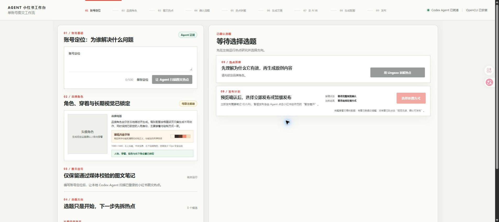

<p align="center">
  
</p>

<h1 align="center">小红书工作台</h1>

</p>
<h2 align="center">如果有帮到你，麻烦动动小手点亮STAR ✨✨</h2>
</p>

> 一个依托 **Codex CLI** 运行的本地小红书图文内容工作台：从热点研究、笔记拆解、原创文稿和去 AI 味，到品牌配图、完整预览与人工确认发布。

Agent 小红书工作台面向需要持续运营多个图文内容账号的创作者。每个内容账号拥有独立的定位、品牌角色、视觉语言、热点缓存、稿件和故事线；它们共用一个仅用于浏览器研究的执行会话。它不接入第三方模型 API，也不托管账号数据；Codex Agent 在你的本地环境中完成推理和浏览器操作。

## 工作台界面



> 截图来自全新的空白工作区，展示账号定位、品牌角色、图文热点、拆解、文稿、配图与发布确认的完整界面；不含任何账号、笔记或发布数据。

## 分发边界

这个仓库交付的是工作流本身：本地前后端、Agent 编排提示、输出 schema、媒体过滤和发布保护、项目特有的 Skill 副本，以及可复现的依赖清单。它**不是**一个把操作系统、Node.js、Codex CLI、Chrome、浏览器扩展或模型运行时打包进 Git 的便携包。

| 随仓库提供 | 由使用者或其 Agent 按 README 准备 |
| --- | --- |
| 工作流系统提示、任务 schema、预览与发布守卫 | Node.js、Git、Codex CLI |
| 小红书图文过滤、热点拆解、去 AI 味与品牌配图规则 | Chrome、OpenCLI Browser Bridge、自己的小红书登录会话 |
| 项目使用的 Skill 副本、`package.json` 与锁文件 | `npm install` 安装的公开 npm 依赖 |
| 公开项目 Logo、文档、测试与 SEO 元数据 | 任何运行时生成的文稿、图片、账号数据和浏览器数据 |

因此，另一位用户或 Agent 克隆仓库后，先阅读本 README 与 [Agent 配置清单](./docs/agent-bootstrap.md)，即可按公开软件的正常安装方式准备运行环境；无需另外寻找本项目的提示词、工作流文件或私有历史素材。

<p align="center">
  <a href="#快速开始"> 快速开始</a>
  &nbsp;&nbsp;
  <a href="#工作流"> 工作流</a>
  &nbsp;&nbsp;
  <a href="#隐私与发布边界"> 隐私边界</a>
</p>

## 它解决什么问题

小红书图文创作常常卡在“热点很多，但不知道该如何变成符合自己账号调性的原创内容”。这个工作台将过程拆成可检查、可编辑、可暂停的步骤：

1. 新建或切换内容账号；新账号从空白定位开始，独立生成品牌角色和视觉语言。
2. 使用共享的浏览器研究会话，按当前内容账号的垂类定位研究小红书图文热点；热点只缓存给该账号，且只保留已验证媒体类型和互动数据的爆款图文笔记。
3. 给出恰好 5 个可编辑的选题方向，并结合该账号手动标记的已发布主题保持内容故事线连续性。
4. 用一个内置的 Lingzao Skill 拆解热点笔记中可借鉴的标题、信息节奏与表达机制，不复制原文或原图。
5. 生成初稿，再通过内置中文去 AI 味 Skill 形成可编辑终稿。
6. 上传任意本地品牌主体图片（人物、动物、吉祥物、物体、植物或图形），或让 Agent 按账号定位设计品牌主体；由 Agent 锁定可见特征与绘制方式。裁切或局部参考图会扩展为明确标注的品牌延展形态，再生成 6 个可逐张预览的系列形象。
7. 由选题和拆解推荐动态视觉方向，并由用户选择本轮生成 1–6 张配图；卡片文稿、角色动作、预览与发布数量始终一致。
8. 在完整预览中查看文稿和全部配图；每轮产出写入版本化的本地 `output/`。未绑定发布账号时流程停在确认产出；绑定后才可选择“立即发布”或“暂缓发布”。

这是一套本地 AI Agent 内容工作流，不是小红书官方产品，也不会声称平台数据或发布结果。

## 工作流

<p align="center">
  
</p>

```text
选择 / 新建内容账号
  -> 账号定位（定位、品牌、热点与故事线隔离）
  -> 上传任意品牌主体母版 或 按定位生成品牌角色
  -> 可辨识特征锁与 6 个系列品牌形象
  -> 共享研究会话按本账号垂类检索图文爆款（排除视频与低互动笔记）
  -> 5 个可编辑选题
  -> Lingzao 单一 Skill 热点拆解
  -> 选择 1–6 张配图
  -> 原始文稿
  -> 中文去 AI 味
  -> 动态视觉推荐与品牌角色配图
  -> 完整预览 / 输入修改意见 / 版本化本地输出
  -> 未绑定发布账号：确认产出并结束
  -> 已绑定发布账号：立即发布 或 暂存离开
  -> 手动标记已发布，写入本账号故事线
```

| 阶段 | 由谁执行 | 关键约束 |
| --- | --- | --- |
| 内容账号 | 用户 + 本地工作台 | 各账号独立保存定位、品牌、热点缓存、稿件、输出和故事线；切换不共享热点 |
| 热点研究 | Codex Agent + OpenCLI 浏览器会话 | 仅保留纯图文，且赞 ≥ 300、藏 ≥ 100 或赞藏合计 ≥ 400；评论不能单独达标 |
| 热点拆解 | Codex Agent + 内置 Lingzao Skill | 只迁移结构和机制，不复制原句、经历、图片或精确版式 |
| 文稿与去 AI 味 | Codex Agent + 内置中文润色 Skill | 原始文稿和去 AI 味版本均可在工作台编辑 |
| 品牌角色 | Codex Agent 的内置生图能力 | 本地上传母版；固定身份、发型、穿着、比例与渲染方式，生成并逐张预览 6 个系列形象 |
| 配图 | Codex Agent 的内置生图能力 | 用户选择 1–6 张；不把提示词、版式说明或 Agent 思考过程写入读者可见图片 |
| 输出与发布 | Codex Agent + 用户浏览器会话 | 每轮先写入版本化 `output/`；发布账号默认未绑定，需用户在当前浏览器会话中手动切换并确认风险后才启用 |
| 故事线 | 用户 + 本地工作台 | 仅手动标记“已发布”后写入当前内容账号的故事线，不读取评论或跨账号历史 |

## 快速开始


### Windows 安装包

Windows x64 用户可从 [GitHub Releases](https://github.com/EthanYoQ/agent-xiaohongshu-workbench/releases/latest) 下载 `Agent-XHS-Workbench-Setup-*.exe`。安装后从开始菜单或桌面启动“Agent 小红书工作台”。它是本地桌面启动器：工作台数据保存到当前 Windows 用户的应用数据目录，不会写入安装包或 GitHub 仓库。

安装包不包含 Codex CLI、Chrome、Browser Bridge 或小红书登录态；首次运行前仍须完成下方的前置条件。需要从源码自行构建时，运行 `npm run package:win`。

### 1. 准备前置条件

- Node.js `>= 22.13`
- 已自行安装并登录的 [Codex CLI](https://github.com/openai/codex)
- Chrome 及用户自己的小红书登录会话
- [OpenCLI Browser Bridge 扩展](https://chromewebstore.google.com/detail/opencli/ildkmabpimmkaediidaifkhjpohdnifk)

Codex CLI 是运行本项目的外部前置条件，**不会被打包、上传或随 `npm install` 安装**。请先确保下面命令可执行：

```powershell
codex --version
```

### 2. 安装项目依赖

```powershell
git clone https://github.com/EthanYoQ/agent-xiaohongshu-workbench.git
cd agent-xiaohongshu-workbench
npm install
npm run setup
npm run dev
```

打开终端提示的本地地址，默认是 `http://127.0.0.1:4173`。

`npm install` 会安装项目需要的 OpenCLI；项目所需的 Lingzao、中文去 AI 味和 OpenCLI 浏览器 Skill 已随仓库包含，无需再克隆其他 Skill 项目。

`node_modules` 不会被提交到 Git。它属于标准公开依赖的本地安装结果，而不是项目交付物；Python 也不是本项目的运行前置条件。

### 3. 连接浏览器

首次执行“图文热点检索”或发布前：

1. 在 Chrome 中安装并启用 OpenCLI Browser Bridge 扩展。
2. 用自己的账号登录小红书，保持对应 Chrome 个人资料已打开。
3. 根据扩展提示连接 Browser Bridge；必要时执行 `npm exec opencli -- doctor` 排查。
4. 回到本地工作台，输入账号定位并开始检索。

工作台不读取、复制或落盘 Cookie、密码和平台 API Key。登录态始终由你的 Chrome 会话管理。

## 运行模型与推理强度


本项目从本机 `PATH` 调用 Codex CLI，默认模型为 `gpt-5.6-terra`。

| 任务 | 推理强度 |
| --- | --- |
| 热点检索、头像/配图、纯视觉修改、发布 | `medium` |
| Lingzao 拆解、初稿、去 AI 味、涉及文稿的修改 | `high` |

生图使用 Codex Agent 运行环境提供的内置 `image_gen` 能力，不需要在本仓库配置模型 API Key；其可用性取决于你的 Codex 环境。

## 内置依赖与 Skill


| 内容 | 本仓库位置 | 用途 | 许可 / 来源 |
| --- | --- | --- | --- |
| OpenCLI | `package.json` | 通过用户浏览器会话读取图文热点、填写内容、发布或暂存 | Apache-2.0，`@jackwener/opencli` |
| Lingzao Skill | `.agents/skills/lingzao/` | 热点笔记的结构化拆解与原创仿写边界；仅保留本流程读取的两个 playbook | MIT-0，`atian-create/lingzao-skill` |
| 中文去 AI 味 Skill | `.agents/skills/humanized-chinese-writing-polisher/` | 去套话、翻译腔和机械排比，保留真实表达 | MIT |
| OpenCLI 浏览器 Skill | `.agents/skills/opencli-browser/` | 给 Codex Agent 的浏览器操作说明 | Apache-2.0，`jackwener/opencli` |

完整的来源和许可说明见 [THIRD_PARTY_NOTICES.md](./THIRD_PARTY_NOTICES.md) 与 [skills-lock.json](./skills-lock.json)。

## 隐私与发布边界


- 公开仓库从空白工作区启动：不含账号定位、热点 URL、原始笔记、评论、历史文稿、图片、发布记录、浏览器日志或登录信息。
- `.data/`、`output/`、`public/generated/`、`public/brand/avatars/` 与 `public/brand/actions/` 都是本地运行数据，已被 Git 忽略；不要手动将它们提交。
- 热点研究排除视频、混合媒体、无法确认媒体类型和互动指标缺失的内容；爆款门槛为赞 ≥ 300、藏 ≥ 100 或赞藏合计 ≥ 400，评论数量不能单独使笔记达标，也不读取评论内容。
- 任何发布动作都需要完成配图和文稿预览，并在界面再次确认。
- 发布账号默认未绑定。用户必须自行在当前浏览器会话切换到目标账号、阅读风控提示并明确启用，工作台不保存 Cookie、密码或账号凭据。
- “立即发布”只有拿到可验证的笔记 ID 或 URL 才记为成功；“暂缓发布”只允许点击小红书创作页文字完全一致的“暂存离开”，绝不点击“发布”。
- 故事线只在用户手动标记“已发布”时更新当前内容账号；不会读取评论、同步创作后台或把失败、草稿、结果不明的任务升级为已发布。
- 请遵守小红书平台规则、适用法律以及原始内容的版权边界；将热点拆解用于原创表达，而不是复刻他人的具体作品。

## 项目结构

```text
.
├─ .agents/skills/                 # 随仓库分发的工作流 Skill
├─ server/                         # 本地 Agent 编排、状态与发布守卫
├─ src/                            # 本地工作台前端
├─ scripts/                        # 媒体探针、图片处理、运行时检查
├─ public/                         # 项目 logo；运行时生成目录被忽略
├─ desktop/                        # Windows 桌面启动器
├─ packages/share-site/            # 可选的静态协作预览站点
├─ docs/seo/                       # 仓库 SEO 元数据与基线记录
└─ test/                           # 核心工作流单元测试
```

`packages/share-site` 是不接登录态的可分享演示站点：它只在访问者浏览器本地保存演示编辑，不会代替本地工作台调用 Codex、抓取热点、生成图片或发布。

## 验证与开发

```powershell
npm run verify:runtime
npm test
npm run build
npm run build:share
npm run package:win
```

## 开源许可

本项目源码使用 [MIT License](./LICENSE)。项目 Logo 由项目发起人提供，仅作为本仓库的识别资产使用。第三方组件和 Skill 的许可不因本项目 MIT 许可而改变。

## 贡献

欢迎提交可复现的问题、隐私安全改进和工作流优化。请不要在 Issue、PR、测试、截图或提交历史中包含真实账号、Cookie、聊天记录、笔记正文或发布结果。
